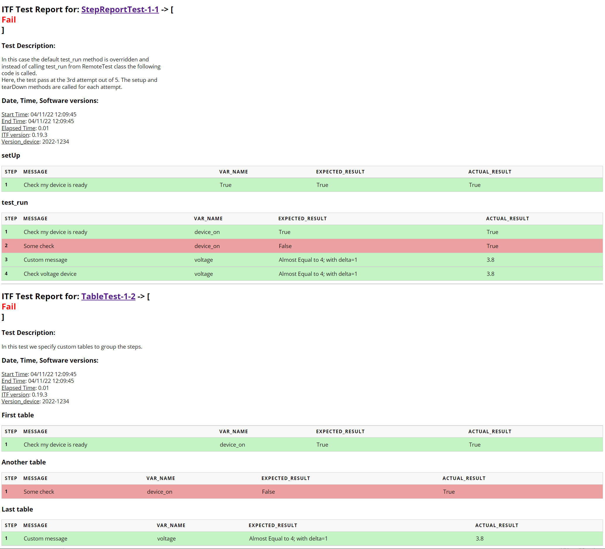

Pykiso Reporting
================

.. _junit_report:

JUnit XML report
~~~~~~~~~~~~~~~~

Generating a JUnit XML report
^^^^^^^^^^^^^^^^^^^^^^^^^^^^^

For CI integration, JUnit reports in XML format can be generated at the end of the test session.
Simply invoke ``pykiso`` with:

.. code:: bash

    pykiso -c my_config.yaml --junit=./path/to/my_report.xml

The resulting report will contain:

- One ``testsuite`` for each ``pykiso.BasicTest``, ``pykiso.BasicTestSuiteSetup``, ``pykiso.BasicTestSuiteTeardown``.
- One ``testcase`` inside the ``testsuite`` for each test method. Using `subTest <https://docs.python.org/3/library/unittest.html#distinguishing-test-iterations-using-subtests>`_
  will also append a ``testcase`` with modified test case name ``"test_method [my subtest description]"``.

.. note:: The captured logs will always appear in the ``testcase`` section.

Adding contextual information to the JUnit report
^^^^^^^^^^^^^^^^^^^^^^^^^^^^^^^^^^^^^^^^^^^^^^^^^

Any user-defined information can be added to all test cases of a test suite as JUnit ``properties``.

In order to add properties, simply define an attribute named ``properties`` as a dictionary inside your test case:

.. code:: python

    @pykiso.define_test_parameters(suite_id=1, case_id=1)
    class MyTest(pykiso.BasicTest)

        def test_run(self):
            remote_dut_software_version = "42.0.0"
            self.properties = {
                "property_name": 42,
                "Software Version": remote_dut_software_version
            }

One useful use case for test case properties is the `Upload of Results to TestRail <https://support.testrail.com/hc/en-us/articles/12609674354068#h_01H9GE9TJ6RD39FCR0FEW0FBBE>`_.

.. _step_test:

HTML system-test (step) report
~~~~~~~~~~~~~~~~~~~~~~~~~~~~~~

The step report aims to provide a more comprehensive test-report (adapted for system testers) by tracking each assertion that contains a message.
It follows the following structure:

- test name
- test description
- date of execution
- elapsed time
- information gathered during test
- assertion detail:
  - value of the data_in
  - variable name of the data_in
  - expected value
  - message
- the report is presented as an HTML page

Usage Examples
^^^^^^^^^^^^^^

.. code:: python

    def setUp(self):
        # Data to test
        device_on = True
        voltage = 3.8

        # Simple assert
        self.assertTrue(device_on, msg="Check my device is ready")

        with self.subTest("Non critical checks"):
            # This check will fail but the test continues
            self.assertFalse(device_on, msg="Some check")

        # Add a new table in the report
        self.step_report.current_table = "Another table"

        # Assert with custom message
        # Assert msg overwritten when step_report_message not null
        self.step_report.message = "Custom message"
        self.assertAlmostEqual(voltage, 4, delta=1, msg="Check voltage device")

        # Additional data to include in the step-report
        self.step_report.header["Version_device"] = "2022-1234"

``self.step_report.header`` allows you to add additional data to the report header during the test execution.

How to generate
^^^^^^^^^^^^^^^

.. code:: bash

  pykiso -c my_config.yaml --step-report=./path/to/my_report.html

Limitations
^^^^^^^^^^^

The step report generator might fail if you put parentheses or "assert" strings in strings or comments in the assert statement.

HTML result example
^^^^^^^^^^^^^^^^^^^

