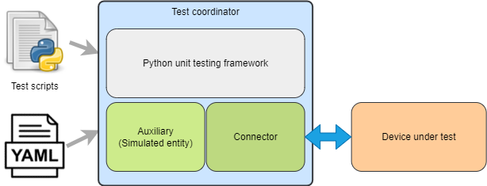

Pykiso Design
=============

Introduction
------------

The *pykiso* Integration Test Framework (ITF) build in a modular and configurable way, which aims to enable the user, to write and run tests on hardware.
Pykiso is build to orchestrate the entities ( e.g. device under test ) and services ( e.g. flash the target ) which are involved in the test.
The Testing Framework can be used for both white-box and black-box testing as well as in the integration and system
testing.

Quality Goals
-------------
The Framework tries to achieve the following quality goals:

+---------------------------+----------------------------------------------------------------------------------------------------+
| Quality Goal (with prio)  | Scenarios                                                                                          |
+===========================+====================================================================================================+
| **Portability**           | The Framework shall run on linux, windows, macOS                                                   |
+---------------------------+----------------------------------------------------------------------------------------------------+
|                           | The Framework shall run on a raspberryPI or a regular laptop                                       |
+---------------------------+----------------------------------------------------------------------------------------------------+
| **Modularity**            | The Framework shall allow me to implement complex logic and to run it over any communication port  |
+---------------------------+----------------------------------------------------------------------------------------------------+
|                           | The Framework shall allow me to add any communication port                                         |
+---------------------------+----------------------------------------------------------------------------------------------------+
|                           | The Framework shall allow me to use private modules within my tests if it respects its APIs        |
+---------------------------+----------------------------------------------------------------------------------------------------+
|                           | The Framework shall allow me to define my own test approach                                        |
+---------------------------+----------------------------------------------------------------------------------------------------+
| **Correctness**           | The Framework shall verify that its inputs (test-setup) are correct before performing any test     |
+---------------------------+----------------------------------------------------------------------------------------------------+
|                           | The Framework shall execute the provided tests always in the same order                            |
+---------------------------+----------------------------------------------------------------------------------------------------+
| **Usability**             | The Framework shall feel familiar for embedded developers                                          |
+---------------------------+----------------------------------------------------------------------------------------------------+
|                           | The Framework shall feel familiar for system tester                                                |
+---------------------------+----------------------------------------------------------------------------------------------------+
|                           | The Framework shall generate test reports that are human and machine readable                      |
+---------------------------+----------------------------------------------------------------------------------------------------+
| **Performance** (new)     | The Framework shall use only the right/reasonable amount of resources to run (real-time timings)   |
+---------------------------+----------------------------------------------------------------------------------------------------+

Design Overview
---------------

The *pykiso* ITF is built in a modular and configurable
way with abstractions for both, entities (e.g. simulated counterpart for the device
under test) and communication (e.g. UART or TCP/IP).

As illustrated in Figure 1, the *pykiso* ITF
is composition of a *test-coordinator*, *auxiliaries* and their corresponding *connectors*.

The tests leverage the python *unittest*-Framework which has a similar
flavor as many available major unit testing Frameworks and thus comes
with an ecosystem of tools and utilities.

Test Coordinator
~~~~~~~~~~~~~~~~

The **test-coordinator** is the central module setting up and running
the tests. Based on a configuration file (in YAML), it does the
following:

-  instantiate the selected connectors
-  instantiate the selected auxiliaries
-  provide the auxiliaries with the matching connectors
-  generate the list of tests to perform
-  provide the testcases with the auxiliaries they need
-  verify if the tests can be performed
-  for remote tests (see :ref:`remote_test`) flash and run and synchronize the tests on the auxiliaries
-  gather the reports and publish the results

Auxiliary
~~~~~~~~~

The **auxiliary** provides to the **test-coordinator** an interface to
interact with the physical or digital device under test.
It can be seen as a helping hand for the test-coordinator to communicate with the device under test,
designated by the term *auxiliary*. It is composed by 2 blocks:

-  instance creation / deletion
-  connectors to facilitate interaction and communication with the
   device (e.g. messaging with *UART*)

If for example an auxiliary needs to interact with cloud services,
it could have:

-  A communication channel (**cchannel**) like *REST*

Create an Auxiliary
^^^^^^^^^^^^^^^^^^^
Detailed information can be found here :ref:`how_to_create_aux`.

Existing Auxiliarys
^^^^^^^^^^^^^^^^^^^
:ref:`acroname_auxiliary` - control an acroname usb hub.

:ref:`communication_auxiliary` - used to for raw byte communication.

:ref:`dut_auxiliary` - allows to flash and run test on the target device.

:ref:`instrument_control_auxiliary` - interface to arbitrary instrument (e.g. power supplies).

:ref:`mp_proxy_auxiliary` - multiprocessing proxy auxiliary

:ref:`proxy_auxiliary` - connect multiple auxiliaries to one unique connector.

:ref:`record_auxiliary` - logging from connector.

:ref:`simulated_auxiliary` - simulated device under test.

:ref:`uds_auxiliary` - uds requests.

:ref:`uds_server_auxiliary` - simulated uds ecu.

:ref:`ykush_auxiliary` - control Yepkit USB hub.

Detailed information about included auxiliarys can be found here :ref:`Existing Auxiliaries`.

Connector
~~~~~~~~~

The communication between the *test-coordinator* and the *device under test* via
the *auxiliary* is enabled by the corresponding connector. The connector can be used either as a *communication channel* or a *flasher*.

Communication Channel
^^^^^^^^^^^^^^^^^^^^^

The Communication Channel - also known as **cchannel** - is the medium
which enables the communication with the device under test. Example include *UART*, *UDP*,
*USB*, *REST*,… The communication protocol itself can be auxiliary
specific.

Create a Connector
^^^^^^^^^^^^^^^^^^
Detailed information can be found here :ref:`how_to_create_connector`.

Dynamic Import Linking
~~~~~~~~~~~~~~~~~~~~~~

The `pykiso` Framework was developed with modularity and reusability in mind.
To avoid close coupling between testcases and auxiliaries as well as between auxiliaries and connectors, the linking between those components is defined in a config file (see :ref:`config_file`) and performed by the `TestCoordinator`.

Different instances of connectors and auxiliaries are given *aliases* which identify them within the test session.

Let's say we have this (abridged) config file:

.. code:: yaml

    connectors:
      my_chan:           # Alias of the connector
        type: ...
    auxiliaries:
      my_aux:            # Alias of the auxiliary
        connectors:
            com: my_chan # Reference to the connector
        type: ...

The auxiliary `my_aux` will automatically be initialised with `my_chan` as its `com` channel.

When writing your testcases, the auxiliary will then be available under its defined alias.

.. code:: python

    from pykiso.auxiliaries import my_aux

The ``pykiso.auxiliaries`` is a magic package that only exists in the ``pykiso`` package after the ``TestCoordinator`` has processed the config file.
It will include all *instances* of the defined auxiliares, available at their defined alias.

Usage
-----

Please see :ref:`config_file` to have a deep-dive on how the pykiso configuration work.

Please see :ref:`How to make the most of the tests` to have a deep-dive on how pykiso tests work.
