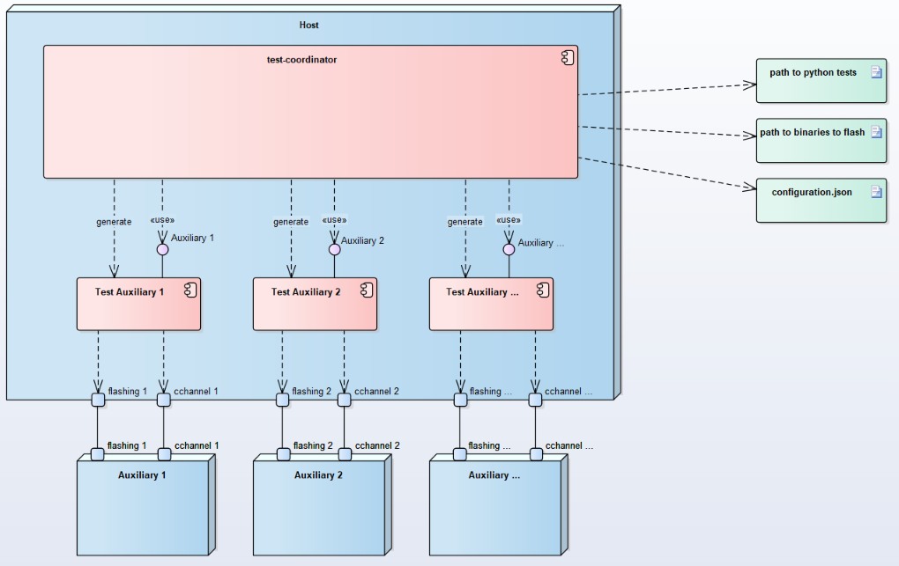

Pykiso
======

Introduction
------------

Integration Test Framework (Pykiso) is a framework that can be used for both
white-box and black-box testing as well as in the integration and system
testing.

Quality Goals
-------------
The framework tries to achieve the following quality goals:

+---------------------------+----------------------------------------------------------------------------------------------------+
| Quality Goal (with prio)  | Scenarios                                                                                          |
+===========================+====================================================================================================+
| **Portability**           | The framework shall run on linux, windows, macOS                                                   |
+---------------------------+----------------------------------------------------------------------------------------------------+
|                           | The framework shall run on a raspberryPI or a regular laptop                                       |
+---------------------------+----------------------------------------------------------------------------------------------------+
| **Modularity**            | The framework shall allow me to implement complex logic and to run it over any communication port  |
+---------------------------+----------------------------------------------------------------------------------------------------+
|                           | The framework shall allow me to add any communication port                                         |
+---------------------------+----------------------------------------------------------------------------------------------------+
|                           | The framework shall allow me to use private modules within my tests if it respects its APIs        |
+---------------------------+----------------------------------------------------------------------------------------------------+
|                           | The framework shall allow me to define my own test approach                                        |
+---------------------------+----------------------------------------------------------------------------------------------------+
| **Correctness**           | The framework shall verify that its inputs (test-setup) are correct before performing any test     |
+---------------------------+----------------------------------------------------------------------------------------------------+
|                           | The framework shall execute the provided tests always in the same order                            |
+---------------------------+----------------------------------------------------------------------------------------------------+
| **Usability**             | The framework shall feel familiar for embedded developers                                          |
+---------------------------+----------------------------------------------------------------------------------------------------+
|                           | The framework shall feel familiar for system tester                                                |
+---------------------------+----------------------------------------------------------------------------------------------------+
|                           | The framework shall generate test reports that are human and machine readable                      |
+---------------------------+----------------------------------------------------------------------------------------------------+
| **Performance** (new)     | The framework shall use only the right/reasonable amount of resources to run (real-time timings)   |
+---------------------------+----------------------------------------------------------------------------------------------------+

Design Overview
---------------

   Figure 1: Integration Test Framework Context

The *pykiso* Testing Framework is built in a modular and configurable
way with abstractions both for entities (e.g. a handler for the device
under test) and communication (e.g. UART or TCP/IP).

The tests leverage the python *unittest*-Framework which has a similar
flavor as many available major unit testing frameworks and thus comes
with an ecosystem of tools and utilities.

Test Coordinator
~~~~~~~~~~~~~~~~

The **test-coordinator** is the central module setting up and running
the tests. Based on a configuration file (in YAML), it does the
following:

-  instantiate the selected connectors
-  instantiate the selected auxiliaries
-  provide the auxiliaries with the matching connectors
-  generate the list of tests to perform
-  provide the testcases with the auxiliaries they need
-  verify if the tests can be performed 
-  for remote tests (see :ref:`../remote_test/remote_test`) flash and run and synchronize the tests on the auxiliaries
-  gather the reports and publish the results

Auxiliary
~~~~~~~~~

The **auxiliary** provides to the **test-coordinator** an interface to
interact with the physical or digital auxiliary target. It is composed
by 2 blocks:

-  instance creation / deletion 
-  connectors to facilitate interaction and communication with the
   device (e.g. messaging with *UART*)

For example auxiliaries like the one interacting with cloud services,
we may have:

-  A communication channel (**cchannel**) like *REST*

Create an Auxiliary
^^^^^^^^^^^^^^^^^^^
Detailed information can be found here :ref:`how_to_create_aux`.

Connector
~~~~~~~~~

Communication Channel
^^^^^^^^^^^^^^^^^^^^^

The Communication Channel - also known as **cchannel** - is the medium
to communicate with auxiliary target. Example include *UART*, *UDP*,
*USB*, *REST*,… The communication protocol itself can be auxiliary
specific.

Create a Connector
^^^^^^^^^^^^^^^^^^
Detailed information can be found here :ref:`how_to_create_connector`.

Dynamic Import Linking
~~~~~~~~~~~~~~~~~~~~~~

The `pykiso` framework was developed with modularity and reusability in mind.
To avoid close coupling between testcases and auxiliaries as well as between auxiliaries and connectors, the linking between those components is defined in a config file (see :ref:`config_file`) and performed by the `TestCoordinator`.

Different instances of connectors and auxiliaries are given *aliases* which identify them within the test session.

Let's say we have this (abridged) config file:

.. code:: yaml

    connectors:
      my_chan:           # Alias of the connector
        type: ...
    auxiliaries:
      my_aux:            # Alias of the auxiliary
        connectors:
            com: my_chan # Reference to the connector
        type: ...

The auxiliary `my_aux` will automatically be initialised with `my_chan` as its `com` channel.

When writing your testcases, the auxiliary will then be available under its defined alias.

.. code:: python

    from pykiso.auxiliaries import my_aux

The `pykiso.auxiliaries` is a magic package that only exists in the `pykiso` package after the `TestCoordinator` has processed the config file.
It will include all *instances* of the defined auxiliares, available at their defined alias.

Usage
-----

Flow
~~~~

1. Create a root-folder that will contain the tests. Let us call it
   *test-folder*.
2. Create, based on your test-specs, one folder per test-suite.
3. In each test-suite folder, implement the tests. (See how below)
4. write a configuration file (see :ref:`config_file`)
5. If your test-setup is ready, run
   ``pykiso -c <ROOT_TEST_DIR>``
6. If the tests fail, you will see it in the the output. For more
   details, you can take a look at the log file (logs to STDOUT as default).

.. note:: User can run several test using several times flag -c. If a folder path is specified,
a log for each yaml file will be stored. If otherwise a filename is provided, all log information
will be in one logfile.

.. _define_test_information:

Define the test information
~~~~~~~~~~~~~~~~~~~~~~~~~~~

For each test fixture (setup, teardown or test_run), users have to define
the test information using the decorator define_test_parameters. This decorator
gives access to the following parameters:

- suite_id : current test suite identification number
- case_id : current test case identification number (optional for test suite setup and teardown)
- aux_list : list of used auxiliaries

In order to link the architecture requirement to the test,
an additional reference can be added into the test_run decorator:

- test_ids : [optional] requirements has to be defined like follow:
{"Component1": ["Req1", "Req2"], "Component2": ["Req3"]}

In order to run only a subset of tests, an additional reference can be added to the test_run decorator:

- variant : [optional] the variant can be defined like:
{"variant": ["variant2", "variant1"], "branch_level": ["daily", "nightly"]}

Both parameters (variant/branch_level), will play the role of filter to fine
tune the test collection and at the end ensure the execution of very specific tests subset.

.. note:: branch_level parameter is also part of the CLI and both (variant/branch_level)
    accept multiple values.

.. code:: bash

    pykiso -c configuration_file --variant var1 --variant var2 --branch-level daily --branch-level nightly

In order to utilise the SetUp/TearDown test-suite feature, users have to define a class inheriting from
BasicTestSuiteSetup (:py:meth:`pykiso.test_coordinator.test_suite.BasicTestSuiteSetup`) or BasicTestSuiteTeardown
(:py:meth:`pykiso.test_coordinator.test_suite.BasicTestSuiteTeardown`).
For each of these classes, the following methods test_suite_setUp or test_suite_tearDown must be overridden with
the behaviour you want to have.

.. note:: Because the python unittest module is used in the background, all methods starting with "def test_" are
executed automatically

Find below a full example for a test suite/case declaration :

.. code:: python

  """
  Add test suite setup fixture, run once at test suite's beginning.
  Test Suite Setup Information:
  -> suite_id : set to 1
  -> case_id : Parameter case_id is not mandatory for setup.
  -> aux_list : used aux1 and aux2 is used
  """
    @pykiso.define_test_parameters(suite_id=1, aux_list=[aux1, aux2])
    class SuiteSetup(pykiso.BasicTestSuiteSetup):
        def test_suite_setUp():
            logging.info("I HAVE RUN THE TEST SUITE SETUP!")
            if aux1.not_properly_configured():
                aux1.configure()
            aux2.configure()
            callback_registering()

  """
  Add test suite teardown fixture, run once at test suite's end.
  Test Suite Teardown Information:
  -> suite_id : set to 1
  -> case_id : Parameter case_id is not mandatory for setup.
  -> aux_list : used aux1 and aux2 is used
  """
    @pykiso.define_test_parameters(suite_id=1, aux_list=[aux1, aux2])
    class SuiteTearDown(pykiso.BasicTestSuiteTeardown):
        def test_suite_tearDown():
            logging.info("I HAVE RUN THE TEST SUITE TEARDOWN!")
            callback_unregistering()

  """
  Add a test case 1 from test suite 1 using auxiliary 1.
    Test Suite Teardown Information:
  -> suite_id : set to 1
  -> case_id : set to 1
  -> aux_list : used aux1 and aux2 is used
  -> test_ids: [optional] store the requirements into the report
  -> tag: [optional] dictionary containing lists of variants and/or test levels when only a subset of tests needs to be executed
  """
    @pykiso.define_test_parameters(
            suite_id=1,
            case_id=1,
            aux_list=[aux1, aux2],
            test_ids={"Component1": ["Req1", "Req2"]},
            tag={"variant": ["variant2", "variant1"], "branch_level": ["daily", "nightly"]},
    )
    class MyTest(pykiso.BasicTest):
        pass

Implementation of Basic Tests
~~~~~~~~~~~~~~~~~~~~~~~~~~~~~

**Structure**: *test-folder*/*test-suite-1*/**test_suite_1.py**

**test_suite_1.py**:

.. code:: python

   """
   I want to run the following tests documented in the following test-specs <TEST_CASE_SPECS>.
   """
    import pykiso
    from pykiso.auxiliaries import aux1, aux2

  """
  Add test suite setup fixture, run once at test suite's beginning.
  Parameter case_id is not mandatory for setup.
  """
    @pykiso.define_test_parameters(suite_id=1, aux_list=[aux1, aux2])
    class SuiteSetup(pykiso.BasicTestSuiteSetup):
        pass

  """
  Add test suite teardown fixture, run once at test suite's end.
  Parameter case_id is not mandatory for teardown.
  """
    @pykiso.define_test_parameters(suite_id=1, aux_list=[aux1, aux2])
    class SuiteTearDown(pykiso.BasicTestSuiteTeardown):
        pass

  """
  Add a test case 1 from test suite 1 using auxiliary 1.
  """
    @pykiso.define_test_parameters(suite_id=1, case_id=1, aux_list=[aux1])
    class MyTest(pykiso.BasicTest):
        pass

  """
  Add a test case 2 from test suite 1 using auxiliary 2.
  """
    @pykiso.define_test_parameters(suite_id=1, case_id=2, aux_list=[aux2])
    class MyTest2(pykiso.BasicTest):
        pass

Implementation of Advanced Tests - Auxiliary Interaction
~~~~~~~~~~~~~~~~~~~~~~~~~~~~~~~~~~~~~~~~~~~~~~~~~~~~~~~~

Using the dynamic importing capabilities of the framework we can interact with the auxiliaries directly.

For this test we will assume that we have configured a :py:class:`pykiso.lib.auxiliaries.communication_auxiliary.CommunicationAuxiliary` and a connector that supports `raw` messaging.

.. code:: python

    """
    send a message, receive a response, compare to expected response
    """
    import pykiso
    from pykiso.auxiliaries import com_aux

    @pykiso.define_test_parameters(suite_id=2, case_id=1, aux_list=[com_aux])
    class ComTest(pykiso.BasicTest):

        STIMULUS = b"stimulus message"
        RESPONSE = b"expected reply"

        def test_run(self):
            com_aux.send_message(STIMULUS)
            resp = com_aux.receive_message()
            self.assertEqual(resp, RESPONSE)

We can use the configured and instantiated auxiliary `com_aux` (imported by it's alias) in the test directly.

Implementation of Advanced Tests - Custom Setup
~~~~~~~~~~~~~~~~~~~~~~~~~~~~~~~~~~~~~~~~~~~~~~~

If you need to have more complex tests, you can do the following:

-  ``BasicTest`` is a specific implementation of ``unittest.TestCase``
   therefore it contains 3 steps/methods **setUp()**, **tearDown()** and
   **test_run()** that can be overwritten.
-  ``BasicTest`` will contain the list of **auxiliaries** you can use.
   It will be hold in the attribute ``test_auxiliary_list``.
-  ``BasicTest`` also contains the following information
   ``test_section_id``, ``test_suite_id``, ``test_case_id``.
-  Import *logging* or/and *message* (if needed) to communicate with the
   **auxiliary**(in that case use RemoteTest instead of BasicTest)

**test_suite_2.py**:

.. code:: python

    """
    I want to run the following tests documented in the following test-specs <TEST_CASE_SPECS>.
    """
    import pykiso
    from pykiso import message
    from pykiso.auxiliaries import aux1

    @pykiso.define_test_parameters(suite_id=2, case_id=1, aux_list=[aux1])
    class MyTest(pykiso.BasicTest):
        def setUp(self):
           # I loop through all the auxiliaries
           for aux in self.test_auxiliary_list:
               if aux.name == "aux1": # If I find the auxiliary to which I need to send a special message, I compose the message and send it.
                   # Compose the message to send with some additional information
                   tlv = { TEST_REPORT:"Give me something" }
                   testcase_setup_special_message = message.Message(msg_type=message.MessageType.COMMAND, sub_type=message.MessageCommandType.TEST_CASE_SETUP,
                                                           test_section=self.test_section_id, test_suite=self.test_suite_id, test_case=self.test_case_id, tlv_dict=tlv)
                   # Send the message
                   aux.run_command(testcase_setup_special_message, blocking=True, timeout_in_s=10)
               else: # Do not forget to send a setup message to the other auxiliaries!
                   # Compose the normal message
                   testcase_setup_basic_message = message.Message(msg_type=message.MessageType.COMMAND, sub_type=message.MessageCommandType.TEST_CASE_SETUP,
                                                           test_section=self.test_section_id, test_suite=self.test_suite_id, test_case=self.test_case_id)
                   # Send the message
                   aux.run_command(testcase_setup_basic_message, blocking=True, timeout_in_s=10)

.. _implementation-of-the-tests-advance-1:

Implementation of Advanced Tests - Test Templates
~~~~~~~~~~~~~~~~~~~~~~~~~~~~~~~~~~~~~~~~~~~~~~~~~

Because we are python based, you can until some extend, design and
implement parts of the framework to fulfil your needs. For example:

**test_suite_3.py**:

.. code:: python

    import pykiso
    from pykiso import message
    from pykiso.auxiliaries import aux1

    class MyTestTemplate(pykiso.BasicTest):
       def test_run(self):
           # Prepare message to send
           testcase_run_message = message.Message(msg_type=message.MessageType.COMMAND, sub_type=message.MessageCommandType.TEST_CASE_RUN,
                                                       test_section=self.test_section_id, test_suite=self.test_suite_id, test_case=self.test_case_id)
           # Send test start through all auxiliaries
           for aux in self.test_auxiliary_list:
               if aux.run_command(testcase_run_message, blocking=True, timeout_in_s=10) is not True:
                   self.cleanup_and_skip("{} could not be run!".format(aux))
           # Device will reboot, wait for the reboot report
           for aux in self.test_auxiliary_list:
               if aux.name == "DeviceUnderTest":
                   report = aux.wait_and_get_report(blocking=True, timeout_in_s=10) # Wait for a report from the DeviceUnderTest
                   break
           # Check if the report for the reboot was received.
           report is not None and report.get_message_type() == message.MessageType.REPORT and report.get_message_sub_type() == message.MessageReportType.TEST_PASS:
               pass # We can continue
           else:
               self.cleanup_and_skip("Device failed rebooting")
           # Loop until all reports are received
           list_of_aux_with_received_reports = [False]*len(self.test_auxiliary_list)
           while False in list_of_aux_with_received_reports:
               # Loop through all auxiliaries
               for i, aux in enumerate(self.test_auxiliary_list):
                   if list_of_aux_with_received_reports[i] == False:
                       # Wait for a report
                       reported_message = aux.wait_and_get_report()
                       # Check the received message
                       list_of_aux_with_received_reports[i] = self.evaluate_message(aux, reported_message)

    @pykiso.define_test_parameters(suite_id=3, case_id=1, aux_list=[aux1])
    class MyTest(MyTestTemplate):
       pass

    @pykiso.define_test_parameters(suite_id=3, case_id=2, aux_list=[aux1])
    class MyTest2(MyTestTemplate):
       pass

Implementation of Advanced Tests - Repeat testCases
~~~~~~~~~~~~~~~~~~~~~~~~~~~~~~~~~~~~~~~~~~~~~~~~~~~

.. automodule:: pykiso.retry_test_case
    :members:

**test_suite_1.py**:

.. code:: python

    # define an external iterator that can be used for retry_test_case demo
    side_effect = cycle([False, False, True])

    @pykiso.define_test_parameters()
    class MyTest1(pykiso.BasicTest):
        """This test case definition will override the setUp, test_run and tearDown method."""

        @pykiso.retry_test_case(max_try=3)
        def setUp(self):
            """Hook method from unittest in order to execute code before test case run.
            In this case the default setUp method is overridden, allowing us to apply the
            retry_test_case's decorator. The syntax super() access to the BasicTest and
            we will run the default setUp()
            """
            super().setUp()

        @pykiso.retry_test_case(max_try=5, rerun_setup=True, rerun_teardown=False)
        def test_run(self):
            """In this case the default test_run method is overridden and
            instead of calling test_run from BasicTest class the following
            code is called.

            Here, the test pass at the 3rd attempt out of 5. The setup and
            tearDown methods are called for each attempt.
            """
            logging.info(
                f"--------------- RUN: {self.test_suite_id}, {self.test_case_id} ---------------"
            )
            self.assertTrue(next(side_effect))
            logging.info(f"I HAVE RUN 0.1.1 for variant {self.variant}!")

        @pykiso.retry_test_case(max_try=3, stability_test=True)
        def tearDown(self):
            """Hook method from unittest in order to execute code after the test case ran.
            In this case the default tearDown method is overridden, allowing us to apply the
            retry_test_case's decorator. The syntax super() access to the BasicTest and
            we will run the default tearDown().

            The retry_test_case has stability test activated, so the tearDown method will
            be run 3 times.
            """
            super().tearDown()

Add Config File
~~~~~~~~~~~~~~~

For details see :ref:`../getting_started/config_file`.

Example:

.. literalinclude:: ../../examples/dummy.yaml
    :language: yaml
    :linenos:

Run the tests
~~~~~~~~~~~~~

``pykiso -c <config_file>``
