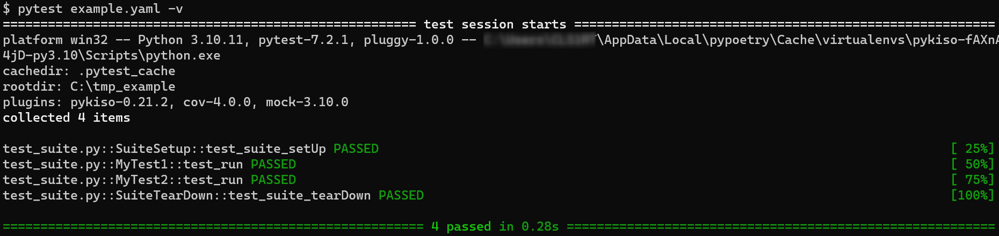

Using Pykiso with Pytest
========================

The pykiso-pytest plugin allows to run pykiso test suites with pytest without any migration effort.
Simply run ``pytest my_test_configuration_file.yaml`` and enjoy!

Still, to benefit from all of pytest's features, your existing test suites can be migrated from
the pykiso (unittest) style to the pytest style.

Running Pykiso tests with pytest
--------------------------------

Let us take as example the following test configuration file and name it ``example.yaml``:

.. code:: yaml

    auxiliaries:
      aux1:
        connectors:
          com: chan1
        config: null
        type: pykiso.lib.auxiliaries.dut_auxiliary:DUTAuxiliary
      aux2:
        connectors:
          com: chan2
        type: pykiso.lib.auxiliaries.dut_auxiliary:DUTAuxiliary
    connectors:
      chan1:
        config: null
        type: pykiso.lib.connectors.cc_example:CCExample
      chan2:
        type: pykiso.lib.connectors.cc_example:CCExample
    test_suite_list:
    - suite_dir: ./
      test_filter_pattern: 'test_suite.py'
      test_suite_id: 1

Along with the following test case as a python module named ``test_suite.py``, located in the
same folder as the test configuration file:

.. code:: python

    import pykiso
    from pykiso.auxiliaries import aux1, aux2

    @pykiso.define_test_parameters(suite_id=1, aux_list=[aux1, aux2])
    class SuiteSetup(pykiso.BasicTestSuiteSetup):
        def test_suite_setUp(self):
            pass

    @pykiso.define_test_parameters(suite_id=1, aux_list=[aux1, aux2])
    class SuiteTearDown(pykiso.BasicTestSuiteTeardown):
        def test_suite_tearDown(self):
            pass

    @pykiso.define_test_parameters(suite_id=1, case_id=1, aux_list=[aux1], tag={"variant": ["v2"]})
    class MyTest1(pykiso.BasicTest):

        def setUp(self):
            self.side_effect = iter([False, True])

        @pykiso.retry_test_case(max_try=2)
        def test_run(self):
            # the retry feature is also available out of the box
            self.assertTrue(next(self.side_effect))

    @pykiso.define_test_parameters(suite_id=1, case_id=2, aux_list=[aux2], tag={"variant": ["v1"]})
    class MyTest2(pykiso.BasicTest):
        def test_run(self):
            self.assertTrue(aux2.is_instance)

Then, executing ``pytest example.yaml -v`` will produce the following output:

Running pytest tests with pykiso test auxiliaries
-------------------------------------------------

One of Pytest's main features are `test fixtures <https://docs.pytest.org/en/7.2.x/explanation/fixtures.html>`_.
These allow you to create a context for your test cases, by specifying a test setup, teardown or more generally
by initializing resources that are then provided to the test cases.

Pykiso's pytest plugin uses fixtures to provide test auxiliaries to test cases. Similarly to the
importable auxiliary aliases in pykiso, the plugin will create fixtures available under this alias.

For example, taking as reference the previous test configuration file and pykiso test suite,
the pykiso test case ``MyTest2`` could be rewritten to:

.. code:: python

    @pytest.mark.tags(variant=["var1"])
    def test_mytest2(aux2):
        assert aux2.is_instance == True

Just like pykiso, an auxiliary will be started as soon as it is used for the first time. It will then
keep running until the end of the test session. To change this behaviour, please refer to `pytest_auxiliary_scope`_.

.. note::
    When writing test cases with pytest, always use plain ``assert`` statements instead of
    e.g. ``assertTrue``. Otherwise pytest does not provide assertion introspection.

Ported pykiso features
----------------------

Filtering test cases
^^^^^^^^^^^^^^^^^^^^

In order to select a subset of the tests to run, 2 options are available:

- | Use pytest's builtin option ``-k``. By modifying the previous command to e.g.
  | ``pytest example.yaml -v -k MyTest1``, only ``MyTest1`` will be run.
- | Use pykiso's test tags feature. By modifying the previous command to e.g.
  | ``pytest example.yaml -v --tags variant=v1``, only ``MyTest1`` will be skipped
  | as it is only meant for a variant tag ``v2``. For more information regarding
  | this pykiso feature, please refer to :ref:`test_tags`.

Adding test case information to JUnit reports
^^^^^^^^^^^^^^^^^^^^^^^^^^^^^^^^^^^^^^^^^^^^^

:ref:`test_requirements` is also supported by the pykiso pytest plugin:

.. code:: python

    @pykiso.define_test_parameters(test_ids={"Variant1": ["Requirement123"]})
    class MyTest2(pykiso.BasicTest):
        def test_run(self):
            self.assertTrue(aux2.is_instance)

    @pytest.mark.test_ids(Variant1=["Requirement123"])
    def test_mytest2(aux2):
        assert aux2.is_instance == True

In order to generate a JUnit report for your test session, simply use pytest's built-in option:

.. code:: bash

    pytest ./example.yaml --junit-xml=./report.xml

Pytest related features
-----------------------

.. _pytest_auxiliary_scope:

Changing the auxiliary fixtures scope
^^^^^^^^^^^^^^^^^^^^^^^^^^^^^^^^^^^^^

As stated previously, the test auxiliary fixtures that are generated from the test configuration file
as scoped session-widely.

However, this can be changed by setting the value ``auxiliary_scope`` to one of the following scope values:

- ``function``: an auxiliary will be stopped and restarted between each test case
- ``class``: an auxiliary will be stopped and restarted between each test class containing test cases
- ``module``: an auxiliary will be stopped and restarted between each test module

This value only needs to be added to the pytest configuration file (``pytest.ini`` or ``pyproject.toml``).
For more information refer to the `pytest documentation <https://docs.pytest.org/en/7.2.x/reference/customize.html#configuration-file-formats>`_.

Customizing an auxiliary setup/teardown
^^^^^^^^^^^^^^^^^^^^^^^^^^^^^^^^^^^^^^^

Pytest allows to 'overwrite' existing features in order to customize then. The fixture only
needs to have the same name as the auxiliary defined in your YAML configuration file and will
wrap the default behaviour of the auxiliary fixture.

Depending on your use-case, this can be done directly within your test module or within pytest's
`conftest.py <https://docs.pytest.org/en/6.2.x/fixture.html#conftest-py-sharing-fixtures-across-multiple-files>`_
file.

Consider a test module were we would need a :ref:`CommunicationAuxiliary <communication_auxiliary>`
named ``my_aux`` within the test configuration file to send data over some communication protocol.
At startup the auxiliary has to send ``hello`` and at teardown ``goodbye``.

With fixtures, this can easily be achieved with:

.. code:: python

    import pytest

    @pytest.fixture(scope="module")
    def my_aux(my_aux):
        # my_aux.create_instance() has been called from the base my_aux fixture
        my_aux.send_message(b'hello')
        yield my_aux
        my_aux.send_message(b'goodbye')
        # my_aux.delete_instance() will now be called from the base my_aux fixture

.. warning:: The customized auxiliary fixture cannot have a higher scope than the wrapping one.

Customizing the setup/teardown of all auxiliaries
^^^^^^^^^^^^^^^^^^^^^^^^^^^^^^^^^^^^^^^^^^^^^^^^^

The pykiso pytest plugin adds two hooks for the startup and teardown
of all test auxiliaries: :py:func:`pykiso.pytest.hooks.pytest_auxiliary_start` and :py:func:`pykiso.pytest.hooks.pytest_auxiliary_stop`.
In very specific use cases, these hooks can be implemented within
a ``conftest.py`` file. The execution of registered hook functions will stop when one hook function
returns a value different from ``None``.

For more information about pytest's hook functions, please refer to
`Writing hook functions <https://docs.pytest.org/en/7.1.x/how-to/writing_hook_functions.html>`.

Other useful pytest features
^^^^^^^^^^^^^^^^^^^^^^^^^^^^

This section aims to provide a non-exhaustive list of potentially interesting features provided by pytest
and by 3rd party pytest plugins:

+------------------------------------------------------------------------------+----------------------------------------------------------------------------------------------------------+------------------------------------------+
| Feature                                                                      | Plugin                                                                                                   | Option                                   |
+==============================================================================+==========================================================================================================+==========================================+
| Stop test execution at the first failure                                     | native                                                                                                   | -x, --exitfirst                          |
+------------------------------------------------------------------------------+----------------------------------------------------------------------------------------------------------+------------------------------------------+
| Re-run the last failed tests                                                 | `native <https://docs.pytest.org/en/7.1.x/how-to/cache.html#rerunning-only-failures-or-failures-first>`_ | --lf, --last-failed                      |
+------------------------------------------------------------------------------+----------------------------------------------------------------------------------------------------------+------------------------------------------+
| Enter the Python debugger (pdb) on test failure                              | `native <https://docs.pytest.org/en/7.1.x/how-to/failures.html#using-python-library-pdb-with-pytest>`_   | -s --pdb                                 |
+------------------------------------------------------------------------------+----------------------------------------------------------------------------------------------------------+------------------------------------------+
| Enter the Python debugger (pdb) on test start                                | native                                                                                                   | -s --trace                               |
+------------------------------------------------------------------------------+----------------------------------------------------------------------------------------------------------+------------------------------------------+
| Use another Python debugger (here `pudb <https://documen.tician.de/pudb/>`_) | native                                                                                                   | --pdbcls=pudb.debugger:Debugger          |
+------------------------------------------------------------------------------+----------------------------------------------------------------------------------------------------------+------------------------------------------+
| Generate an HTML test report                                                 | `pytest-html <https://pytest-html.readthedocs.io/en/latest/>`_                                           | --html=report.html --self-contained-html |
+------------------------------------------------------------------------------+----------------------------------------------------------------------------------------------------------+------------------------------------------+
| Repeating one or multiple tests for a certain amount of times                | `pytest-repeat <https://github.com/pytest-dev/pytest-repeat/tree/master>`_                               | --count=N                                |
+------------------------------------------------------------------------------+----------------------------------------------------------------------------------------------------------+------------------------------------------+
| Rerun failing tests for a maximum amount of times                            | `pytest-rerunfailures <https://github.com/pytest-dev/pytest-rerunfailures/tree/master>`_                 | --reruns=N                               |
+------------------------------------------------------------------------------+----------------------------------------------------------------------------------------------------------+------------------------------------------+
