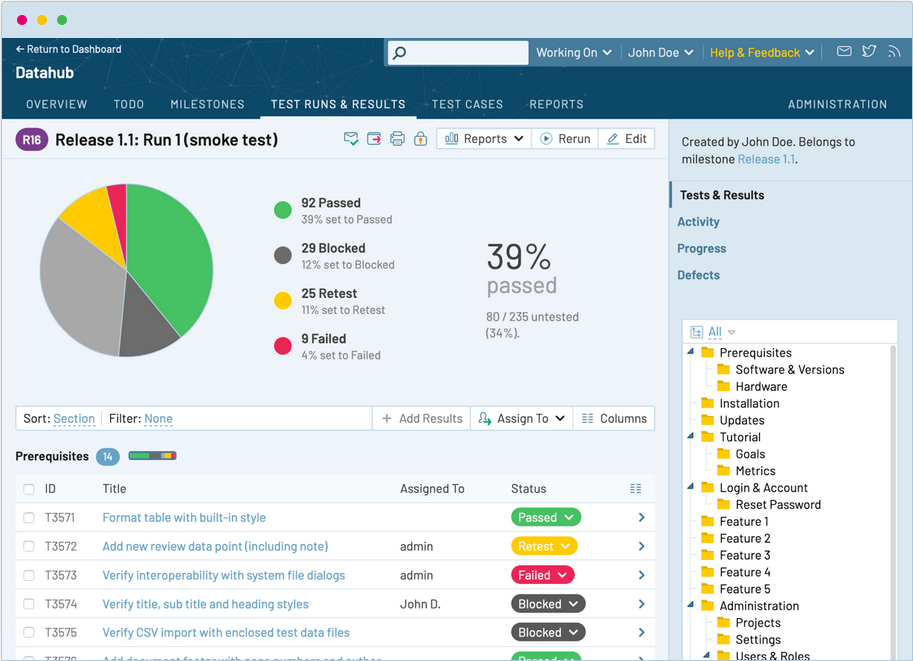

.. _testrail:

Export results on TestRail
==========================

The ``testrail`` CLI utility takes your Pykiso Junit report and export them on `TestRail <https://www.gurock.com/testrail/>`__.

Upload your results
-------------------
To upload your results on TestRail users have to follow the command :

.. code:: bash

    testrail --user USER_ID --password MY_API_KEY --url https\\:testrail_server.com upload --run--name "sample run" --project "project sample" --suite "suite 1" --milestone "sample 2023" --results path/to/reports/folder --tag VTestId --custom-field custom_vteststudio_id

Options:
  --user TEXT           TestRail user id  [required]
  --password TEXT       Valid TestRail API key (if not given ask at command prompt
                        level)  [optional]
  --url TEXT            URL of TestRail server  [required]
  -n, --run-name TEXT   How to name the created run on TestRail  [required]
  -p, --project TEXT    TestRail's project name  [required]
  -s, --suite TEXT      TestRail's suite name  [required]
  -m, --milestone TEXT  TestRail's milestone name  [required]
  -r, --results PATH    full path to the folder containing the JUNIT reports
                        [required]
  --tag TEXT            attribute in JUNIT report use to store requirements
                        ids [optional] [default value: VTestId]
  --custom-field TEXT   TestRail's case custom field use to store the
                        requirement id [optional][default value: custom_vteststudio_id]
  --help                Show this message and exit.

The above command will create a brand new run on TestRail side with the following values :
 - associated the run to the TestRail project  -> "project sample"
 - for a suite called -> "suite 1"
 - define for the milestone -> "sample 2023"
 - upload all the results contained in -> path/to/reports/folder
 - all TestRail's ids will be found under tag "VTestId" in each JUNIT report
 - the ids under tag "VTestId" will be associated to a custom id created on TestRail case side call custom_vteststudio_id

After a successful command a new run is added :

Useful commands
---------------

Find below additional commands use to display different entities of TestRail (suite, case, project, milestone...).

Returns the list of available projects :

.. code:: bash

    testrail --user USER_ID --password MY_API_KEY --url https\\:testrail_server.com projects

Returns a list of all the test suites contained in a given project.

.. code:: bash

    testrail --user USER_ID --password MY_API_KEY --url https\\:testrail_server.com suites --project "super project"

Returns a list of all the cases contained in a given project.

.. code:: bash

    testrail --user USER_ID --password MY_API_KEY --url https\\:testrail_server.com cases --project "super project"

Returns a list of all the runs contained in a given project.

.. code:: bash

    testrail --user USER_ID --password MY_API_KEY --url https\\:testrail_server.com runs --project "super project"

Returns the list of all milestones contained in a given project.

.. code:: bash

    testrail --user USER_ID --password MY_API_KEY --url https\\:testrail_server.com milestones --project "super project"
